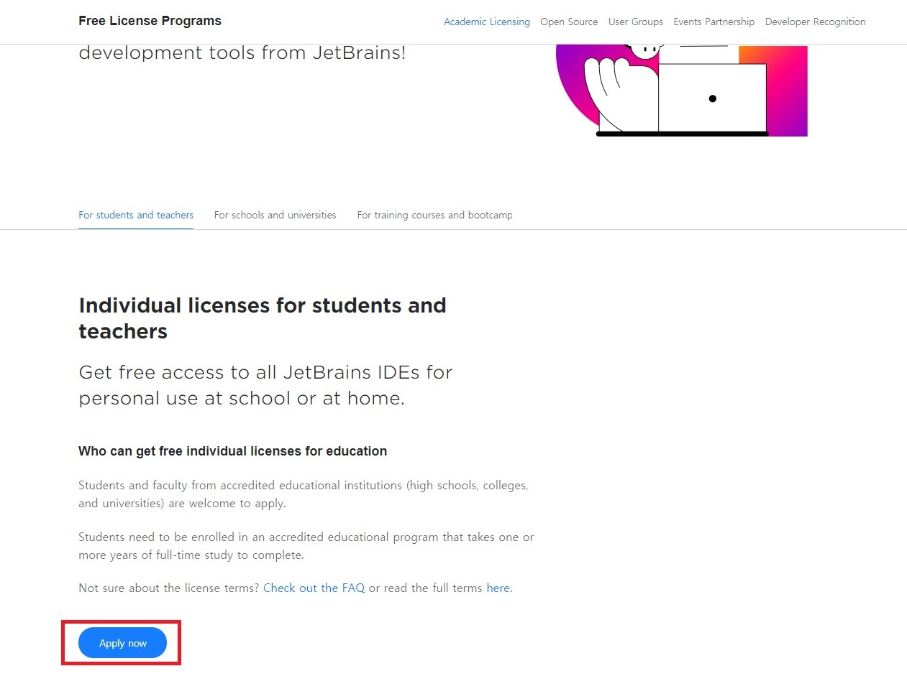
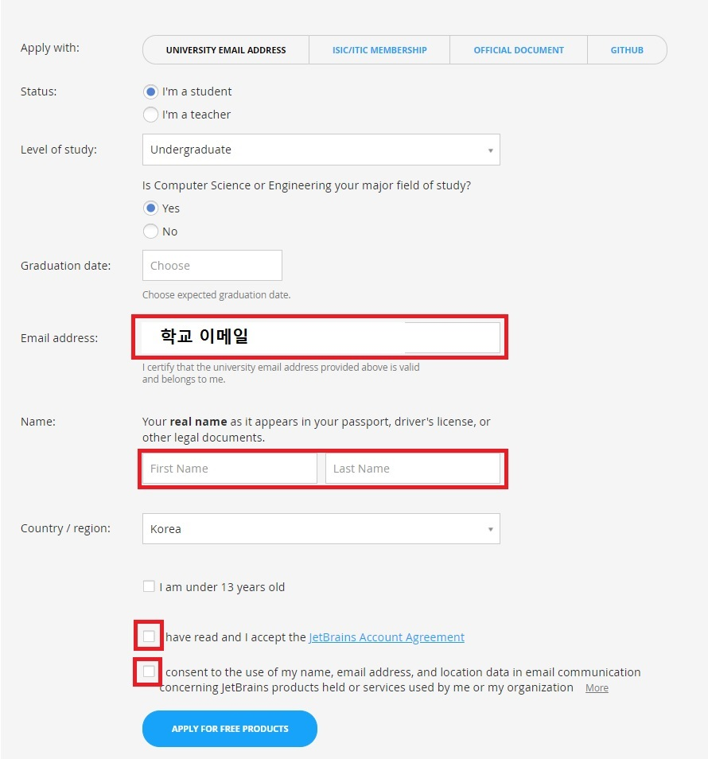
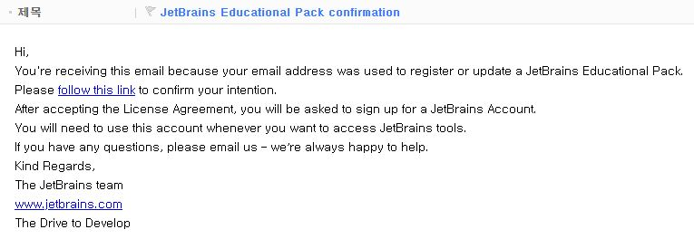
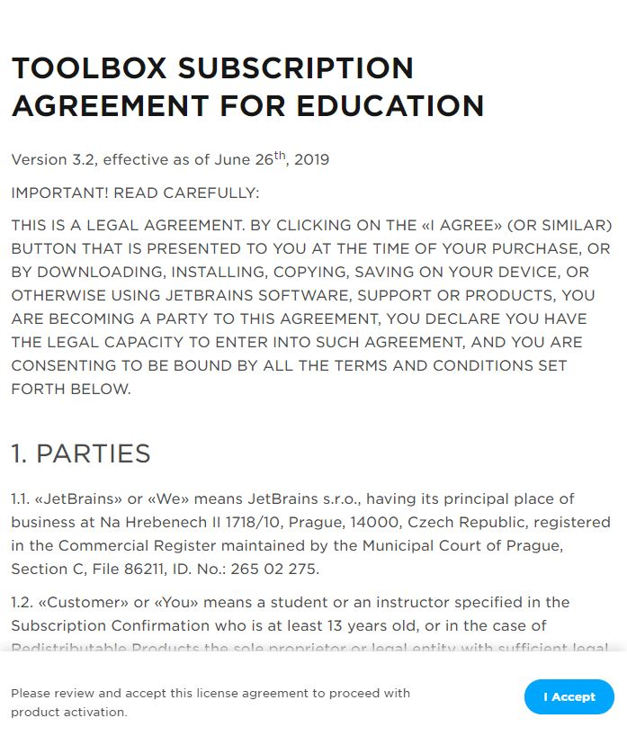
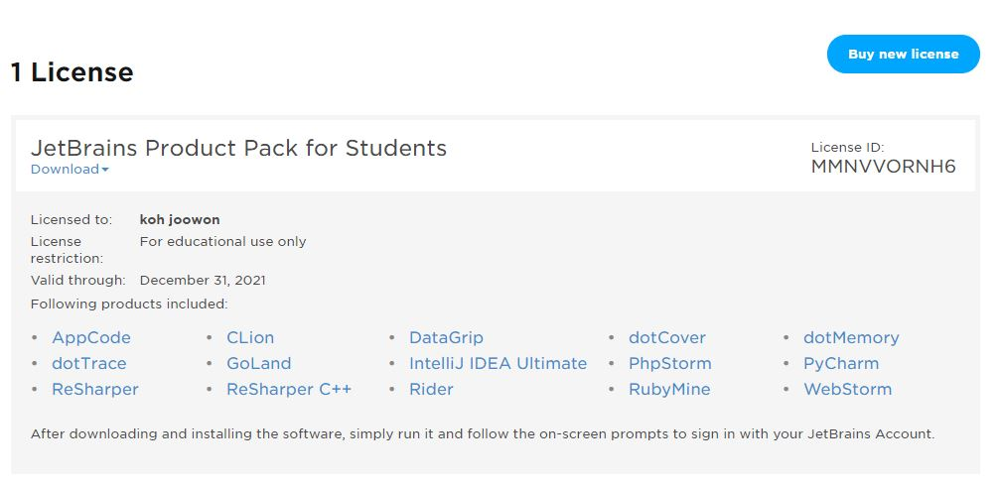

## IntelliJ IDEA 학생 인증 설치 방법
---
 

**안녕하세요**  컴퓨터를 포멧하고 학교 강의해서 익숙하게 사용하던   
Java IDE인 이클립스(Eclipse) 보다 더 좋다는 인텔리제이 (IntelliJ)  
설치 과정을 포스팅 해보고자 합니다.  
- *학생이면 **무료** 라고 합니다.*  
>설치 방법 

1. JetBrains 학생 인증 방법 
    
    - [>> JetBrains 학생 인증 사이트](https://www.jetbrains.com/community/education/#students)

 

"Apply now" 버튼을 클릭합니다.

 
 
 

 

    1. Graduation date (졸업예정 연도) 설정합니다. 
    2. Email address에 학교 이메일을 입력합니다.
    3. 이름을 입력합니다.
    4. 체크 박스 두개를 체크합니다.
    5. 다 입력 하였으면 APPLY FOR FREE PRODUCTS를 클릭합니다.

 
<성공화면>

학교 메일로 이동

 
 

<인증 메일>

"follow this link" 클릭

 
 

"I Accept" 클릭

 
 

회원가입할 이메일 입력

적은 이메일 접속후 메일 확인

 
 

<인증 메일>

"Confirm your account"클릭

이동한 사이트에서 회원가입 정보를 기입하고

"Submit"클릭

 
 

성공화면

라이센스가 없다고 뜬다면 학교 인증메일에서 

"follow this link" 클릭

이동한 페이지에서 회원가입한 아이디로 로그인

